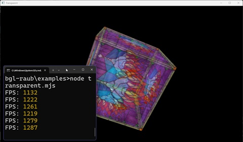

# WebGL for Node.js

This is a part of [Node3D](https://github.com/node-3d) project.

[](https://badge.fury.io/js/webgl-raub)
[](https://github.com/node-3d/webgl-raub/actions/workflows/eslint.yml)
[](https://github.com/node-3d/webgl-raub/actions/workflows/test.yml)
[](https://github.com/node-3d/webgl-raub/actions/workflows/cpplint.yml)

```console
npm i -s webgl-raub
```



**WebGL**/**OpenGL** bindings. The addon **does not provide** a window control system, and it
**can not set up an OpenGL context** on its own. This API simply maps the
native OpenGL function calls to their JS counterparts.

**TL;DR**: For a quick start, use [3d-core-raub](https://github.com/node-3d/3d-core-raub)
or try the [Examples](/examples) (and note [package.json](/examples/package.json)).

> Note: this **addon uses N-API**, and therefore is ABI-compatible across different
Node.js versions. Addon binaries are precompiled and **there is no compilation**
step during the `npm i` command.


## Details

```js
const webgl = require('webgl-raub');
```

Here `webgl` contains the **WebGL** API, like a `WebGLRenderingContext` instance would. See
[WebGLRenderingContext docs](https://developer.mozilla.org/en-US/docs/Web/API/WebGLRenderingContext)
for reference, and [TypeScript definitions](/index.d.ts) for the full list of exports.

To use browser **WebGL** libs, like [three.js](https://threejs.org/),
several additional interfaces must also be provided to mimic the browser.

* Package [glfw-raub](https://github.com/node-3d/glfw-raub) provides window/context handling
and additional browser-like interfaces.
* Package [image-raub](https://github.com/node-3d/glfw-raub) loads and serves the image data as web
[Image](https://developer.mozilla.org/en-US/docs/Web/API/HTMLImageElement#example) would.

Those two are bundled into
the [3d-core-raub](https://github.com/node-3d/3d-core-raub) in a following manner:

```js
const image = require('image-raub');
const webgl = require('webgl-raub');
const { Document } = require('glfw-raub');

Document.setImage(image); // plug this Image impl into the Document
Document.setWebgl(webgl); // plug this WebGL impl into the Document

const doc = new Document();
global.document = global.window = doc;

const canvas = document.createElement('canvas'); // === doc
const gl = canvas.getContext('webgl'); // === webgl
```

You can optionally call `webgl.init()` after the GL context becomes available - this translates
into a `glewInit()` call. See [GLEW docs](https://glew.sourceforge.net/basic.html) for what
it does and if you need it (probably "yes"?).

> OSX Note: some features may depend on OpenGL profile being used. Core profile
is necessary for VAO and other OpenGL 3.2+ features. Depending on your windowing
backend, set the OpenGL profile of your preference.
In case [glfw-raub](https://github.com/node-3d/glfw-raub) is used,
the profile can be set through the `Window`/`Document`
[constructor](https://github.com/node-3d/glfw-raub#class-window) or with
`glfw.windowHint` calls.


---

## WebGL Libs

* [three.js](https://threejs.org/) - known to work well on **Node.js** with this
implementation of **WebGL**.
* [PixiJS](https://pixijs.com/) - seems to work with some minor hacks, as proven by this
[example](https://github.com/node-3d/3d-core-raub/blob/master/examples/pixi/index.js).

Using [node-3d-core](https://github.com/node-3d/3d-core-raub), you can skip setting up
most environment features for those libs.
