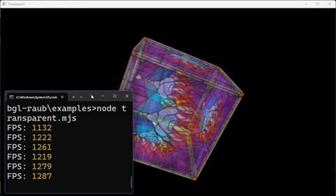

# WebGL for Node.js

This is a part of [Node3D](https://github.com/node-3d) project.

[](https://badge.fury.io/js/@node-3d/webgl)
[](https://github.com/node-3d/webgl/actions/workflows/lint.yml)
[](https://github.com/node-3d/webgl/actions/workflows/test.yml)
[](https://github.com/node-3d/webgl/actions/workflows/cpplint.yml)

```console
npm install @node-3d/webgl
```

> This addon is ABI-compatible across Node.js versions. **There is no compilation** during `npm install`.



**TL;DR**: For a quick start, use [@node-3d/core](https://github.com/node-3d/core)
or look at [Examples](/examples).

```js
import { webgl } from '@node-3d/webgl';
```

Here `webgl` contains the **WebGL/OpenGL** API, like a `WebGLRenderingContext` instance would.
* See [WebGLRenderingContext docs](https://developer.mozilla.org/en-US/docs/Web/API/WebGLRenderingContext)
    for reference.
* There are also non-WebGL methods exported in case you want to use advanced OpenGL functions.
* The addon **does not provide** a window control system, you can use
    [@node-3d/glfw](https://github.com/node-3d/glfw) (or anything else!) to create a window.

## API

### `webgl`

The main export is a singleton object shaped like a WebGL rendering context.
It includes:

* WebGL 1 style constants and functions.
* WebGL 2 functions where supported by the native addon.
* Selected OpenGL functions that are useful in Node3D integrations.
* Browser-style constructors: `WebGLBuffer`, `WebGLTexture`, `WebGLProgram`,
  `WebGLShader`, `WebGLFramebuffer`, `WebGLRenderbuffer`, `WebGLVertexArrayObject`,
  `WebGLQuery`, `WebGLSampler`, `WebGLSync`, `WebGLTransformFeedback`,
  `WebGLUniformLocation`, and `WebGLActiveInfo`.

Important helpers:

* `webgl.init()` - initializes GLEW after an OpenGL context is current.
* `webgl.useWebGL2()` - switches prototypes/globals so browser libraries see WebGL 2.
* `webgl.extractId(object)` - returns the raw OpenGL resource ID wrapped by WebGL objects.
* `webgl.getSupportedExtensions()` - returns Node3D extension names.
* `webgl.getGLExtensions()` - returns native OpenGL extension strings.
* `webgl.getExtension(name)` - returns a supported extension object.

### `classes`

The `classes` namespace exports the wrapper classes used by `webgl`.
Most applications do not instantiate them directly, except when wrapping an existing native
OpenGL resource ID.


## WebGL Libs

To use browser **WebGL** libs, like [three.js](https://threejs.org/),
several additional interfaces must also be provided to mimic the browser.

* Package [@node-3d/glfw](https://github.com/node-3d/glfw) provides window/context handling
and additional browser-like interfaces.
* Package [@node-3d/image](https://github.com/node-3d/glfw) loads and serves the image data as web
[Image](https://developer.mozilla.org/en-US/docs/Web/API/HTMLImageElement#example) would.

See [this example](/examples/textured.ts) using both **GLFW** and **Image**.
The main idea being as follows:

```js
import { Image } from '@node-3d/image';
import { webgl } from '@node-3d/webgl';
import { glfw } from '@node-3d/glfw';
const { Document } = glfw;

Document.setImage(image); // plug Image impl into the Document
Document.setWebgl(webgl); // plug WebGL impl into the Document

const doc = new Document({ width: 1600, height: 900, vsync: true });
...
```

Similarly, these modules are utilized in [@node-3d/core](https://github.com/node-3d/core).
Using [@node-3d/core](https://github.com/node-3d/core), you can skip setting up
most environment features for those libs.

* [three.js](https://threejs.org/) - known to work well on **Node.js** with this
implementation of **WebGL**.
* [PixiJS](https://pixijs.com/) - seems to work with some minor hacks, as proven by this
[example](https://github.com/node-3d/core/blob/master/examples/pixi/index.ts).


## Native OpenGL

This is real **native OpenGL**, not ANGLE or anything else.
You have direct access to GL resource IDs. Due to WebGL
convention, resource IDs are wrapped in objects, such as `WebGLBuffer`. All of them
contain raw IDs as `obj._` - the `_` property. You can also create such objects based on
OpenGL IDs that are obtained elsewhere (e.g. from other separate C++ addons).

The JS API mostly maps the native OpenGL function calls. E.g.:

```cpp
// gl.clear(target)
DBG_EXPORT JS_METHOD(clear) { NAPI_ENV;
	REQ_INT32_ARG(0, target);
	glClear(target);
	RET_WEBGL_VOID;
}
```

You can optionally call `webgl.init()` after the GL context becomes available - this translates
into a `glewInit()` call. See [GLEW docs](https://glew.sourceforge.net/basic.html) for what
it does and if you need it (probably "yes"?).


## MacOS Note

Some features may depend on OpenGL profile being used. Core profile
is necessary for VAO and other OpenGL 3.2+ features. Depending on your windowing
backend, set the OpenGL profile of your preference.
In case [@node-3d/glfw](https://github.com/node-3d/glfw) is used,
the profile can be set through the `Window`/`Document`
[constructor](https://github.com/node-3d/glfw#class-window) or with
`glfw.windowHint` calls.

